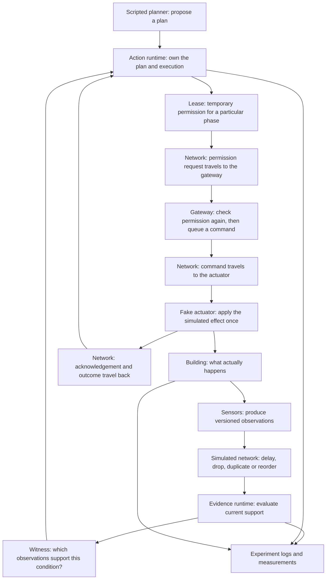

# Week 5: testing when communication goes wrong

Week 4 gave us a building to experiment with. Week 5 gives its messages an
unreliable journey. A reading, permission request, command or result can arrive
late, disappear, arrive twice, arrive out of order, or encounter a disconnected
link. We can now test how those failures affect both decisions and completion.

Everything is still software-based. The runtime, building, network and tests are
Rust. Python runs batches of experiments and produces the comparison report.
There is no real network service to install, and the AI planner remains Week 6.

## How the pieces work together



The simulator's virtual clock and event queue coordinate every arrow. The arrows
do not represent separate operating-system processes yet.

| Piece | Its job | Why we need it |
| --- | --- | --- |
| Building model | Store what is actually happening: occupants, fan state, door position and so on | Gives the experiment an independent reference for checking decisions |
| Sensor adapter | Turn the building state into an observation with a version, observation time and expiry | The runtime needs explicit evidence rather than direct access to truth |
| Network simulator | Decide when, whether and how many times a message arrives | Lets us reproduce communication failures |
| Assurance graph | Describe which conditions depend on which observations | A failure affects the conclusions that depend on it |
| Witness evaluator | Find sufficient supporting evidence and its usable lifetime | Two healthy sensors can sometimes replace one missing sensor |
| Action runtime | Keep start, run, commit and outcome obligations separate | Starting safely does not prove that continued execution or commitment is safe |
| Lease and gateway | Issue limited permission and recheck it when dispatch is attempted | Evidence or the plan might change while the permission request travels |
| Fake actuator | Perform the simulated command; suppress duplicate or obsolete commands it has already recognized | A duplicated packet must not produce a second execution |
| Outcome processing | Match the result to the command and check completion evidence | Sending a command, or receiving an acknowledgement, is not proof of success |
| Experiment runner | Give each policy the same starting plan and external fault conditions | Makes comparisons defensible |
| Reports | Preserve decisions, results, failures, timings and replay instructions | Gives us evidence to inspect rather than an impressive-looking demonstration |

The observer can inspect the building's true state to score an experiment. That
privileged view is not passed into the runtime's admission decisions.

## One example, from observation to outcome

Imagine that two sensors support a hazard conclusion and the fan's other start
conditions are valid.

1. The sensors send their readings through the simulated network.
2. The assurance runtime finds a sufficient witness and the action runtime issues
   a short-lived start lease.
3. The request carrying that lease travels to the gateway. During that journey,
   one selected observation is refreshed to a newer version.
4. The gateway rejects the old lease. Its recorded version no longer matches.
   It queues no start command under that old authority.
5. A fresh lease can be requested from the current evidence. If it reaches the
   gateway while still usable, a command is queued.
6. The command travels to the actuator. A duplicated copy does not run it twice.
7. The actuator performs the simulated effect and sends its result back.
8. The action becomes Completed only if the correlated result and outcome
   contract support completion. A lost result can leave success unconfirmed even
   when the simulated physical effect happened.

There is a second boundary worth understanding: **a runtime cancellation cannot
instantly stop a command that has already left the gateway.** The actuator must
receive the recovery command. The delayed-controller test demonstrates this and
reports a missed deadline when the response takes too long.

## Try the communication experiments

Run a nominal plan with several communication faults combined:

```sh
cargo run --offline --bin sim -- --scenario S1 --network compound --baseline B5 --out target/my-week-five-run
```

For an interactive session:

```sh
cargo run --offline --bin sim -- --scenario S1 --network delay --interactive
```

Then use the same controls as Week 4:

```text
advance 40ms
status
explain alarm.start
advance 80ms
events 12
run 10s
save target/my-network-session
quit
```

`NetworkSend` records the planned deliveries or loss. `ObservationRejected`
identifies an older or duplicate observation. `AuthorityRejected` records a
permission that could not pass the gateway's checks. `ResultRejected` identifies
an old, duplicate or superseded response.

| Network profile | What it changes |
| --- | --- |
| `none` | Immediate reliable delivery; comparison control |
| `delay` | Delays messages and adds extra travel time for permission requests |
| `loss` | Drops a seeded selection of messages |
| `duplicate` | Sends every message twice |
| `reorder` | Delays selected messages enough for newer messages to overtake them |
| `partition` | Disconnects cloud observations and permission requests temporarily; local actuator traffic remains available |
| `compound` | Combines delay, jitter, loss, duplication, reordering and a partition |
| `stale-lease` | Delays permission requests beyond the one-second lease cap |
| `slow-controller` | Delays actuator-bound commands, exposing reaction-deadline failure |

Changing the baseline changes its admission policy. Changing the network profile
changes the communication conditions. These are separate experimental factors.

## Run the comparative pilot

```sh
python3 scripts/run_week_five.py
```

This command first checks the earlier milestone and the Week 5 fault tests. It
then builds release-mode executables, runs the baseline comparisons, removes
selected features for comparison, repeats headline runs from saved manifests,
and measures full versus incremental evaluation at several graph sizes.

Results go into `target/week-five-pilot`. The directory must be new; use
`--out target/week-five-pilot-2` for another run.

| Output | How to use it |
| --- | --- |
| `pilot-report.md` | Start here: readable results, ties, adverse comparisons and limitations |
| `pilot-report.json` | Detailed acceptance findings and all matched comparisons |
| `pilot.csv` | One row per experiment for further analysis |
| `fault-validation.json` | Named checks for the communication milestone |
| `verification/` | Complete tests, formatting/lint checks and CLI verification evidence |
| `runs/` | Every run's manifest, metrics, logs, workload and transport records |
| `replays/` | Repeated headline experiments for exact semantic comparison |
| `scale/` | Graph-size sweep and evaluator timings |

Replay a single saved manifest:

```sh
cargo run --offline --bin sim -- --manifest target/my-week-five-run/manifest.json --out target/my-week-five-replay
```

Replay needs the same implementation for an exact comparison. Host performance
measurements and report creation timestamps may vary.

## What a result means

We ask three separate questions: do the algorithms agree with the reference;
does the richer policy make a defensibly useful decision in concrete cases; and
is measured local processing comfortably below the illustrative reaction margin?

A policy that never executes anything may avoid unsafe releases while accomplishing
nothing. A policy that completes more actions may have ignored missing evidence.
We therefore inspect safety-related counts and completion together, and retain
cases where the proposed policy ties or does worse.

For example, removing hazard redundancy after the fan has already started can
make no difference: hazard confirmation belongs to its start contract, while
pressure and fan health govern its run contract. That neutral result is expected
and is included in the pilot.

The graph-size sweep measures actual host elapsed time. Network delay and reaction
deadlines use simulated time. A fast evaluator cannot compensate for a command
that spends too long in transit.

See the [technical reference](week-five-reference.md) for exact fault parameters,
matching rules, replay semantics and acceptance limits.


The [first pilot findings](week-five-findings.md) explain the measured outcomes,
including the cases where B5 completed less work and why.
